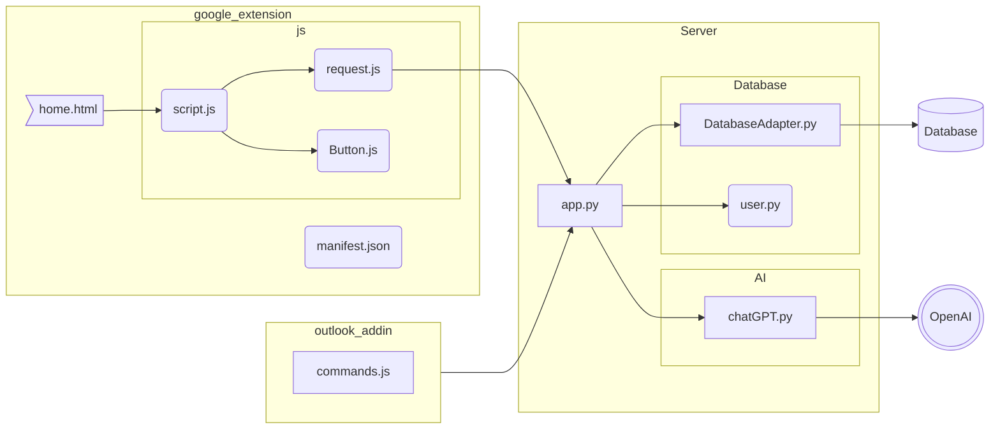

Arrows represent interaction, not necessarily flow of information

```mermaid
flowchart LR
    subgraph google_extension

        H>home.html]
        subgraph js
            script(script.js)
            request(request.js)
            button(Button.js)
            end

        manifest(manifest.json)

    end
    
    subgraph outlook_addin
        commands[commands.js]
    end

    subgraph Server
        
        app[app.py]


        subgraph Database

            adapter[DatabaseAdapter.py]
            user(user.py)

        end     
        
        
        subgraph AI 
            gpt[chatGPT.py]
        end

    end

    id1[(Database)]

    H-->script

   
    
    app-->adapter
    app-->user
    app-->gpt

    script-->request
    script-->button
    


    adapter-->id1

    request-->app
    
    
    gpt-->openai
    openai(((OpenAI)))
    
    outlook_addin --> app
    
    

```
